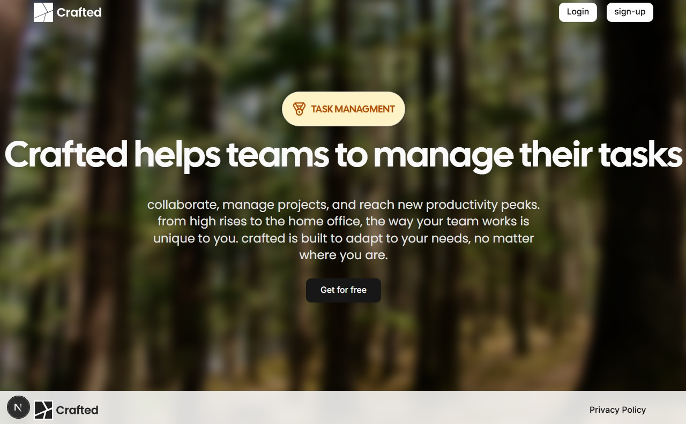
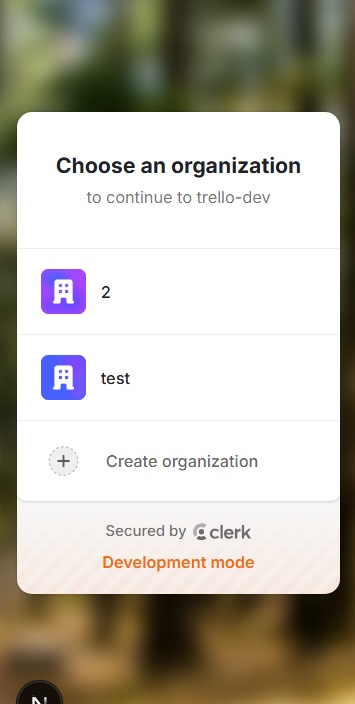

# 🚀 Stephano Salazar | Portfolio



---

## ✨ Descripción

Portfolio interactivo de **Stephano Salazar**. Presenta proyectos destacados, animaciones web, desarrollo frontend y backend con tecnologías modernas como Next.js, React, GSAP y TailwindCSS.

---

## 🛠️ Tecnologías principales


---

## 📸 Preview



---

## ⚡ Instalación rápida

```bash
pnpm install
pnpm dev
```

Abre [http://localhost:3000](http://localhost:3000) en tu navegador para ver el resultado.

---

## 🧩 Estructura del proyecto

```
src/
  app/
  components/
  public/
  ...
```

---

## 🌐 Despliegue

El proyecto está optimizado para Vercel. Puedes desplegarlo fácilmente usando:

[](https://vercel.com/new)

---

## 📚 Recursos

- [Next.js Docs](https://nextjs.org/docs)
- [React Docs](https://react.dev/)
- [GSAP Docs](https://greensock.com/docs/)
- [TailwindCSS Docs](https://tailwindcss.com/docs)

---

## 👤 Autor

**Stephano Salazar**  
[GitHub](https://github.com/Stephanosalazar18)

---

## 📬 Contacto

¿Te gustaría colaborar o tienes alguna duda? Escríbeme por [LinkedIn](https://www.linkedin.com/in/stephano-salazar/) o abre un issue.
